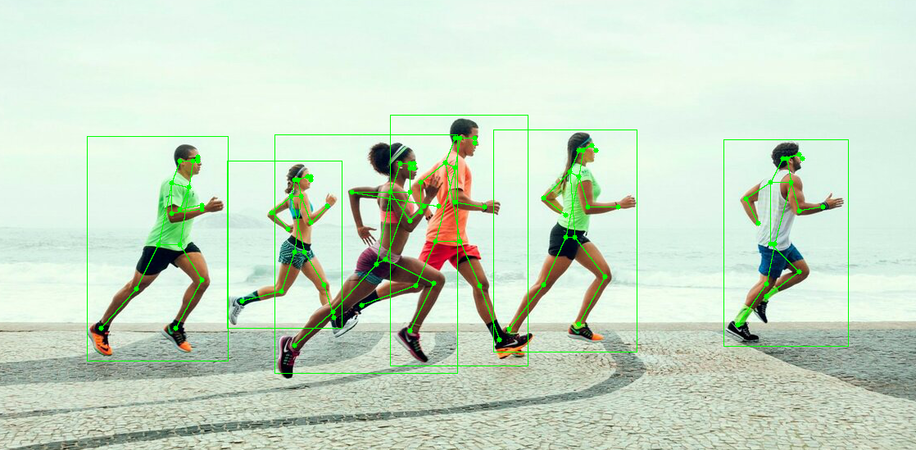

## Cvartel Open Source Face SDK

[Cvartel Face SDK](sdk/) is an open-source library that analyzes images to identify human faces, bodies and skeletal joints. The library is top rated in NIST FRVT with 99.62% face recognition accuracy and is available for C++, Python, C#, and Java programming languages on Windows and Linux.
It contains [Open Model Improvement and Domain Adaptation Scripts](open_midas/) which allows you to improve model performance for your specific tasks.

|Face Detection and Landmarks|Face Recognition|Face Attributes|
|--|--|--|
||| |
| Detect Faces and Face Landmarks| Create and Match Face Templates | Estimate age, gender, emotions and much more|

|Body Detection and Human Pose Estimation|
|--|
||
| Detect Human Bodies and Estimate Skeleton Keypoints| 

See the list of [available models](sdk/).

## Open MIDAS

Beside SDK this repository provides Open Model Improvement and Domain Adaptation Scripts. This toolkit contains the set of techniques and pipelines for models retraining and generalization improvement.  
Check out [BatchNorms training technique](open_midas/README.md) - our first published method (very easy to use fine-tune technique, +2%TPR@1e-6 for pretrained models form insightface repo).

## Getting Started 
* Learn how to [install the library](docs/getting_started.md)
* Read the [user manual](docs/user_manual.md)

## Contributions

Improvements to the Open Source Face SDK and Open MIDAS are always welcome. Please fork the repository and get started. 
Feel free  to open an issue if you want to
* report a bug
* submit a fix
* discuss current state of this repo
* propose a new feature

## License

[Affero GPLv3](http://www.gnu.org/licenses/agpl-3.0.html)
Commercial-friendly licensing available. Contact us at info@cvartel.com.
